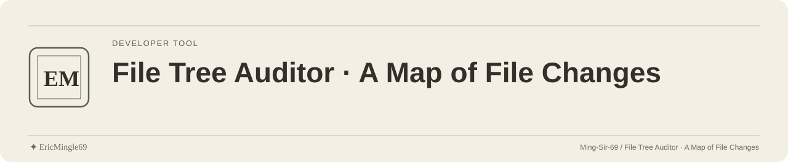

<picture>
  <source media="(prefers-color-scheme: dark)" srcset="readme-assets/header-dark.svg">
  <source media="(prefers-color-scheme: light)" srcset="readme-assets/header-light.svg">
  
</picture>

<p align="center">
  <a href="README.md">简体中文</a> · <a href="README.en.md">English</a> · <a href="PERSONAL-NOTICE.md">✦ EricMingle69</a>
</p>

# File Tree Auditor · A Map of File Changes

Scan a local project to generate a file tree, incremental differences and date-based views.
For organizing materials, structural handoffs and change tracking; analysis uses paths and filesystem metadata.

## Start from source

Prepare Python 3 and run from the repository root:

```sh
python3 scripts/file-tree-auditor.py --target "/path/to/project"
python3 scripts/file-tree-auditor.py --target "/path/to/project" --no-diff
```

Replace the path with an authorized target. Use a directory copy first to understand outputs.
The script imports the standard library directly; [requirements.txt](requirements.txt) does not establish extra charting features.

## What it writes

Reports are written inside `--target`; later runs update them and `_data_structure.json`.

| Output | Contents |
| --- | --- |
| `<directory>_文件结构.md` | File tree |
| `<directory>_差异对比.md` | Added, removed, modified and moved items against the old baseline |
| `<directory>_今日新增.md` | Files with today's modification time, including changes to old files |
| `<directory>_月度归档.md` / `每日归档.md` | Date-organized views |
| `<directory>_加班输出资料.md` | Reference records using fixed date rules |
| `_data_structure.json` | Metadata baseline for the next comparison |

The first run has no old JSON for a full incremental comparison; `--no-diff` still updates other reports and JSON.

## Released programs

[v2.1](https://github.com/Ming-Sir-69/file-tree-auditor/releases/tag/v2.1) includes named Linux x64, macOS arm64 and Windows x64 assets.
Check binary compatibility and parameter consistency against the actual version; a source ZIP is not one of these programs.

## Interpretation boundaries

File times alone do not establish work hours, authorship or quality; reports are not Git history or content audits.
The overtime classification currently fixes dates to 2025-07-01 through 2026-06-26 with fixed holiday rules.
Exclusions do not cover every sensitive path; inspect directory and time information before sharing.

## Implementation and permission

[The script](scripts/file-tree-auditor.py) is the entry; [the build workflow](.github/workflows/build.yml) records packaging.
No LICENSE covers the original code; confirm reuse and redistribution permission.

---

Documentation maintained by **✦ EricMingle69** · [Ming-Sir-69](https://github.com/Ming-Sir-69)  
[Personal identity, licensing and permissions](PERSONAL-NOTICE.md) · The header follows your GitHub theme.
